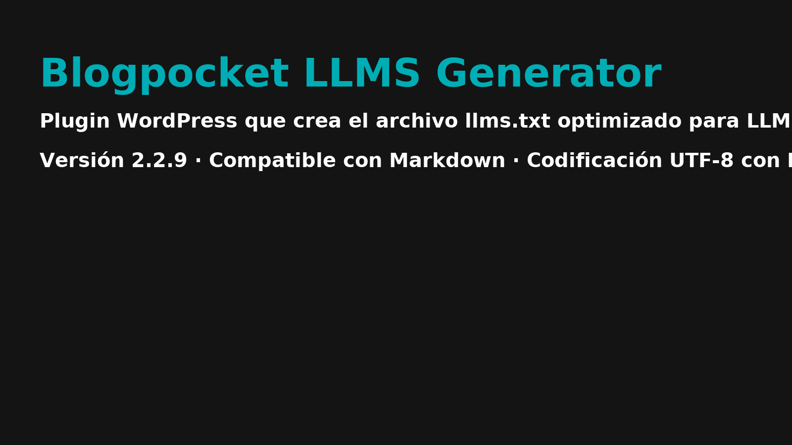

# Blogpocket LLMS Generator

**Versión:** 2.2.11 
**Autor:** Antonio Cambronero  
**Licencia:** GPLv2 o posterior  
**Sitio oficial:** https://blogpocket.com

## Descripción

Este plugin de WordPress genera y mantiene automáticamente un archivo `llms.txt` en la raíz del sitio web, pensado para ser consumido por modelos de lenguaje (LLMs).  
El formato del archivo es compatible con Markdown y sigue esta estructura:

- Cada entrada se muestra en formato:
  - `[Título escapado](URL): Extracto escapado` (si hay extracto)
  - `[Título escapado](URL)` (si no hay extracto)

- Se escapan los caracteres especiales de Markdown en títulos y extractos (\ ` * _ { } [ ] ( ) # + - . ! |)
- Cada tipo de contenido se organiza en bloques con encabezados como `## Entradas`, `## Páginas`, etc.
- El archivo `llms.txt` se guarda en codificación UTF-8 con BOM para compatibilidad de lectura en navegadores.

## Funcionalidades

- Activación y desactivación desde el panel de administración.
- Selección de tipos de contenido a incluir.
- Añade nuevas publicaciones automáticamente.
- Regenera el archivo en ediciones o eliminaciones.
- Limpieza automática del archivo si se desactiva el plugin.
- Cumple con los requisitos de compatibilidad para SEO y consumo por LLMs.

## Instalación

1. Sube el archivo ZIP a tu WordPress (`Plugins` > `Añadir nuevo` > `Subir plugin`).
2. Activa el plugin.
3. Accede al menú **LLMS Generator** del panel de administración.
4. Configura qué tipos de contenido quieres incluir.
5. Activa la generación automática del archivo.

## Requisitos

- WordPress 5.8 o superior.
- Permisos de escritura en el directorio raíz del sitio.

## Seguridad

Este plugin no recoge ni transmite ningún dato personal. Todo el procesamiento se realiza de forma local en tu servidor WordPress.

## Advertencia

⚠️ Antes de usar en un sitio en producción, prueba el plugin en un entorno de pruebas.  
Asegúrate de que tu instalación tiene permisos de escritura adecuados.

## Captura de pantalla

